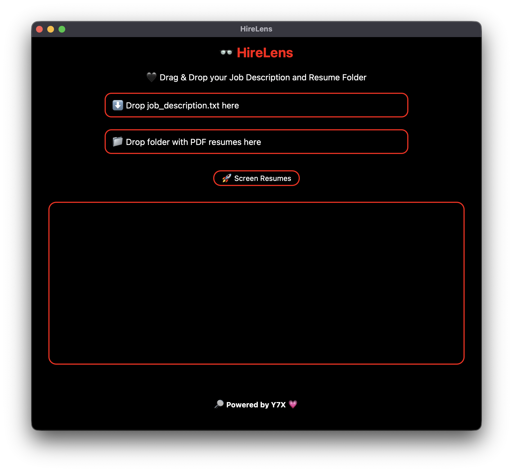

<div align="center">

# 💼 HireLens
**🧠 HireLens: Smart screening meets slick design**

An offline, amoled AI resume screener that ranks PDF resumes based on how well they match a job description.  
Powered by smart NLP scoring and drag & drop magic.
Branded with 💗 by [Y7X-bit](https://github.com/Y7X-bit)



</div>

---

## 🌟 Features at a Glance

🖥️ **Total AMOLED UI** – zero gray, full black  
📄 **Drag & Drop** support for job description and resume folder  
📊 **AI Scoring** using TF-IDF + Cosine Similarity  
📁 **Auto Save** ranked output as `ranking_output.csv`  
🧠 **Keyword Match** view per resume

---

## 🖥️ Installation

> Python 3.9 or later required

```bash
git clone https://github.com/Y7X-bit/HireLens.git
cd HireLens
pip install -r requirements.txt
python HireLens.py